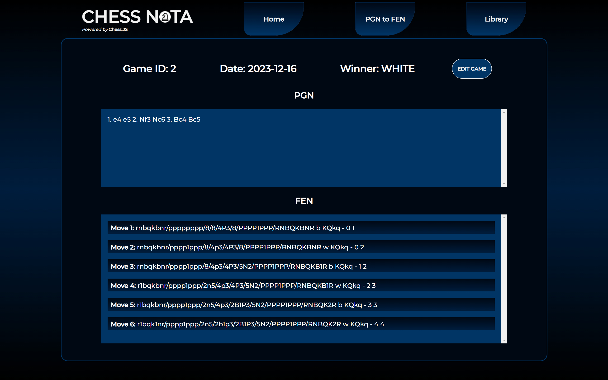

# Chess-Nota

**Splash Screen**

Chess-Nota is a React Chess application developed to allow users to convert PGN (Portable Game Notation) to FEN (Forsythe-Edwards Notation) strings.

Technologies used: Vite, React.JS, Node.JS, HTML5 & CSS. 

### Game Screen

### Library Screen

## ERD

### 'users' Table

| Column Name | Data-type     | Description |
| :-------- | :------- | :-----------|
| `user_id`      | ` SERIAL PRIMARY KEY NOT NULL` | Primary Key
| `username` | `VARCHAR(255) NOT NULL` | username
| `password` | `VARCHAR(255) NOT NULL` | stored hashed password value